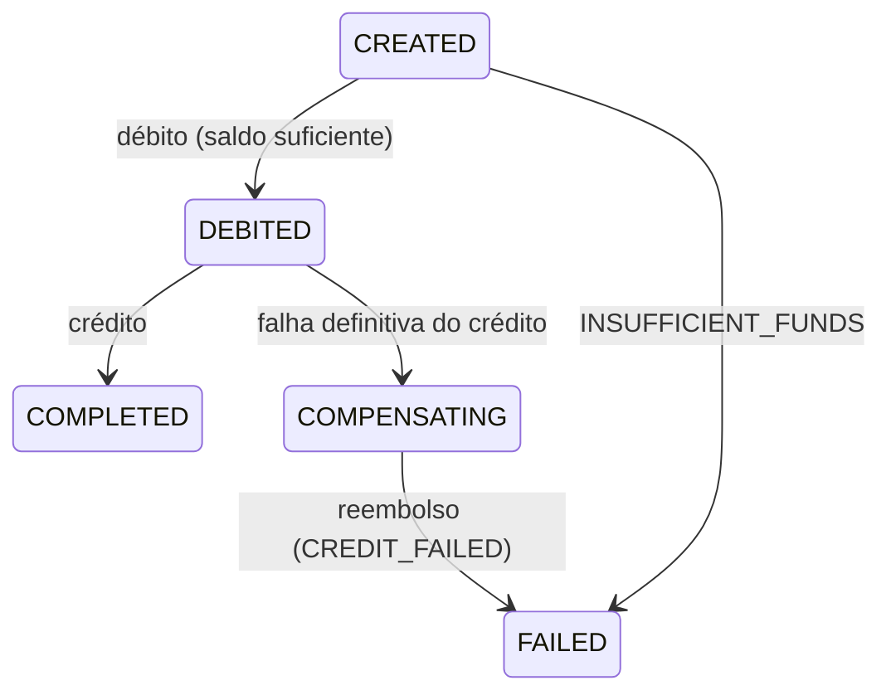

# Banco Demo v1 — Backend

Backend local de um app bancário de demonstração: signup/signin/signout,
saldo, contatos salvos e transferências simuladas entre contas fictícias, com
**CQRS** e **Saga orquestrada e persistida** sobre um arquivo SQLite.

- Stack: **Node.js 24 + TypeScript (strict, ESM) + Fastify 5 + better-sqlite3 + Vitest**
- Especificação: `docs/prd-backend.md` (PRD) e `docs/contrato-compartilhado.md`
  (contrato normativo de rotas/DTOs/seed/erros). Este README descreve a
  implementação.

## 1. Requisitos

- **Node.js 24** (`.nvmrc` fixa `24`; `engines: ">=24 <25"`). `nvm use` resolve.
- npm 10+.
- `better-sqlite3` usa binário pré-compilado; se o download falhar, é preciso
  toolchain de build (`python3`, `make`, `g++`) para compilar o nativo.

## 2. Quickstart

```bash
nvm use            # Node 24
npm ci
cp .env.example .env
npm run db:reset   # cria data/bank.sqlite com migrate + seed
npm run dev        # API em http://127.0.0.1:3001
```

Em outro terminal:

```bash
# signin (grava o cookie em cookies.txt)
curl -i -c cookies.txt -X POST http://127.0.0.1:3001/v1/auth/signin \
  -H 'Content-Type: application/json' \
  -d '{"email":"alice@demo.local","password":"Demo123!"}'

# saldo
curl -b cookies.txt http://127.0.0.1:3001/v1/accounts/me/balance

# transferência para Bruno (R$ 100,00)
curl -i -b cookies.txt -X POST http://127.0.0.1:3001/v1/transfers \
  -H 'Content-Type: application/json' \
  -H 'Idempotency-Key: alice-bruno-001' \
  -d '{"recipientAccountId":"acc-bruno","amountCents":10000,"note":"Almoço"}'

# acompanhar (202 PENDING → COMPLETED ou FAILED)
curl -b cookies.txt http://127.0.0.1:3001/v1/transfers/<id>
```

Reiniciar o processo **não** reseta nem semeia nada: `server.ts` só roda
`migrate`. Reset explícito: `npm run db:reset` ou `POST /__test/reset`
(controles de teste).

## 3. Credenciais demo (seed)

Senha de todas: **`Demo123!`**

| Usuário | E-mail | user.id | account.id | Saldo inicial |
|---|---|---|---|---:|
| Alice Demo | alice@demo.local | user-alice | acc-alice | 100000 |
| Bruno Demo | bruno@demo.local | user-bruno | acc-bruno | 25000 |
| Carla Demo | carla@demo.local | user-carla | acc-carla | 0 |

Contato inicial: `contact-bruno` (Alice → acc-bruno). Sem transferências.
Soma inicial: **125000 centavos**. Novo signup cria conta com saldo zero.

## 4. Scripts

| Script | O que faz |
|---|---|
| `npm run dev` | `tsx watch src/server.ts` (API + worker no mesmo processo) |
| `npm run build` | `tsc` (dist) + copia migrações `.sql` |
| `npm start` | roda o build (`node dist/server.js`) |
| `npm run typecheck` | `tsc --noEmit` (inclui testes) |
| `npm test` | Vitest — **testes unitários** (ver §11) |
| `npm run db:migrate` | aplica migrações versionadas em `DATABASE_PATH` |
| `npm run db:seed` | migra + garante o seed (idempotente, nunca altera saldos) |
| `npm run db:reset` | migra + **reset explícito** à fotografia inicial |
| `npm run openapi` | regenera `openapi.json` a partir dos schemas |

## 5. CQRS — onde está cada caminho

Rotas são finas: validam transporte (JSON Schema sem coerção), autenticam e
encaminham. Regra fica em handlers. **Nenhum** handler de query escreve;
nenhuma rota chama um service CRUD indiferenciado.

| Rota | Arquivo de rota | Caminho de escrita (comando) | Caminho de leitura (query) |
|---|---|---|---|
| POST /v1/auth/signup | `src/modules/auth/routes.ts` | `src/modules/auth/commands/signup.ts` (user+conta+sessão em 1 tx) | — |
| POST /v1/auth/signin | `src/modules/auth/routes.ts` | `src/modules/auth/commands/signin.ts` | — |
| POST /v1/auth/signout | `src/modules/auth/routes.ts` | `src/modules/auth/commands/signout.ts` | — |
| GET /v1/me | `src/modules/accounts/routes.ts` | — | `src/modules/auth/queries/get-me.ts` |
| GET /v1/accounts/me/balance | `src/modules/accounts/routes.ts` | — | `src/modules/accounts/queries/get-balance.ts` |
| GET /v1/recipients/:accountId | `src/modules/contacts/routes.ts` | — | `src/modules/contacts/queries/get-recipient.ts` |
| GET /v1/contacts | `src/modules/contacts/routes.ts` | — | `src/modules/contacts/queries/list-contacts.ts` |
| POST /v1/contacts | `src/modules/contacts/routes.ts` | `src/modules/contacts/commands/add-contact.ts` | — |
| POST /v1/transfers | `src/modules/transfers/routes.ts` | `src/modules/transfers/commands/request-transfer.ts` (transfer+job em 1 tx) | — |
| GET /v1/transfers | `src/modules/transfers/routes.ts` | — | `src/modules/transfers/queries/list-transfers.ts` |
| GET /v1/transfers/:id | `src/modules/transfers/routes.ts` | — | `src/modules/transfers/queries/get-transfer.ts` |

Passos internos da Saga (escrita): `src/modules/transfers/saga/steps.ts` +
`orchestrator.ts`; worker: `src/modules/worker/worker.ts`. SQL vive em
repositórios/read models (`session-repository.ts`, handlers e steps), não nas
rotas. Commands e queries compartilham o mesmo banco SQLite (permitido pelo
PRD §4).

## 6. Saga de transferência

Cada etapa tem **commit local próprio**; estado e efeitos financeiros são
atômicos por passo. Uma única transação cobrindo débito+crédio seria
insuficiente para avaliar compensação/recuperação — por isso não existe.

| Etapa interna | Status público | O que o commit persiste junto |
|---|---|---|
| CREATED | PENDING | transferência + chave de idempotência + job durável (tx do comando) |
| DEBITED | PROCESSING | débito condicionado a saldo + ledger DEBIT + `in_transit=amount` |
| COMPLETED | COMPLETED | crédito + ledger CREDIT + `in_transit=0` + job DONE |
| COMPENSATING | PROCESSING | falha definitiva de crédito registrada (recuperável) |
| FAILED (antes do débito) | FAILED | motivo `INSUFFICIENT_FUNDS`; nenhum efeito financeiro |
| FAILED (após compensação) | FAILED | reembolso + ledger COMPENSATION + `in_transit=0` + job DONE; motivo `CREDIT_FAILED` |



- **Ponto de não retorno**: o commit do crédito (COMPLETED). Depois dele a
  Saga nunca compensa o remetente.
- **Idempotência por passo**: todo `UPDATE` de progresso tem guarda
  `AND saga_step = <esperado>`; reexecução/redelivery é no-op
  (`ALREADY_APPLIED`). O banco garante ≤1 DEBIT/CREDIT/COMPENSATION por
  transferência (`UNIQUE(transfer_id, type)`) e exclusividade CREDIT ×
  COMPENSATION (triggers).
- **Compensar = somar de volta** o valor debitado — nunca restaurar snapshot
  (não apaga operações legítimas concorrentes).
- **Invariantes** (verificadas em teste e reconciliáveis, §8): saldo inteiro
  ≥ 0; `Σ saldos + Σ in_transit = 125000`; estado terminal ⇒ `in_transit=0`;
  CREDIT e COMPENSATION nunca coexistem.

## 7. Persistência

Arquivo SQLite em `DATABASE_PATH` (default `./data/bank.sqlite`; nunca
`:memory:` no app). Migração única versionada:
`src/db/migrations/001_init.sql`.

- Pragmas por conexão: `journal_mode=WAL`, `foreign_keys=ON` (verificado),
  `busy_timeout=5000`, `synchronous=NORMAL`.
- Constraints relevantes: e-mail único; 1 conta por usuário; saldo
  `INTEGER >= 0` (tabela `STRICT` rejeita float/string em dinheiro);
  `amount_cents BETWEEN 1 AND 100000000`; `source <> recipient`;
  `UNIQUE(source_account_id, idempotency_key)`;
  `UNIQUE(owner, recipient)` em contatos; coerência
  `status='FAILED' ↔ failure_code NOT NULL`.
- **Ledger imutável** (auditável): triggers abortam `UPDATE`/`DELETE` e
  violações de ordem (crédito/compensação sem débito; crédito após
  compensação). O reset de teste recria o schema (`DROP TABLE` + migrate),
  nunca apaga lançamentos.
- Seed (`src/db/seed.ts`) é idempotente: `ON CONFLICT DO NOTHING`; **nunca**
  reaplica saldo nem apaga operações. Reset (`resetDatabase`) é explícito.

## 8. Reconciliação de saldos e ledger

Sem depósitos/taxas/reset, com o seed inicial vale sempre:

```
saldo(conta) = saldo_seed(conta) + Σ ledger_da_conta        (DEBIT negativo)
Σ saldos + Σ in_transit = 125000
```

SQL pronto:

```sql
-- saldo por conta vs seed + ledger
SELECT a.id,
       a.balance_cents AS saldo_atual,
       CASE a.id
         WHEN 'acc-alice' THEN 100000
         WHEN 'acc-bruno' THEN 25000
         WHEN 'acc-carla' THEN 0
         ELSE 0 END AS saldo_seed,
       COALESCE(SUM(l.amount_cents), 0) AS ledger_liquido
FROM accounts a LEFT JOIN ledger_entries l ON l.account_id = a.id
GROUP BY a.id;

-- conservação de dinheiro (deve fechar 125000 em qualquer estado)
SELECT SUM(balance_cents) + (SELECT COALESCE(SUM(in_transit_cents),0) FROM transfers)
  AS total_conservado FROM accounts;

-- um passo por tipo e por transferência
SELECT transfer_id, type, COUNT(*) FROM ledger_entries
GROUP BY transfer_id, type HAVING COUNT(*) > 1;   -- vazio = ok
```

Contas criadas por signup somam zero ao total.

## 9. Worker e retries

Um worker vive **no mesmo processo da API** (`src/modules/worker/worker.ts`),
lendo a job table (`jobs`) como outbox durável:

- **Claim com lease**: `UPDATE ... WHERE run_after <= now AND (lock livre ou
  expirado)`; um job nunca roda duas vezes simultaneamente (claim condicional
  + conjunto in-flight local). Concorrência 4 — uma saga pausada não bloqueia
  as outras.
- **Polling** (`WORKER_POLL_INTERVAL_MS`, default 200 ms) + **wake**
  imediato quando o POST aceita uma transferência (meta: terminal ≤ 5 s).
- **Boot**: libera locks de execuções anteriores (`releaseAllLocks`) e roda um
  tick imediato — sagas em CREATED/DEBITED/COMPENSATING retomam pelo estado
  persistido (meta ≤ 10 s).
- **Falhas transitórias** (`SQLITE_BUSY`/`SQLITE_LOCKED`): retry por passo
  (5 tentativas, backoff 25 ms·2ⁿ + jitter, teto 1 s). Esgotou → job
  reagendado com backoff (200 ms·2^attempts, teto 5 s), status permanece
  PENDING/PROCESSING — **nunca** FAILED sem compensar.
- **Shutdown gracioso** (SIGINT/SIGTERM): worker espera in-flight → app → db.

## 10. Controles de teste

Documentação completa com curl e roteiro de recuperação em
**[`docs/test-controls.md`](docs/test-controls.md)**. Resumo: com
`ENABLE_TEST_CONTROLS=true` + `TEST_CONTROL_TOKEN`, expõem
`POST /__test/reset`, `POST /__test/faults` (FAIL_CREDIT_ONCE /
PAUSE_AFTER_DEBIT) e `POST /__test/release`, protegidos por
`X-Test-Control-Token`. Com a flag desligada: 404. Essas rotas não estão no
`openapi.json`.

## 11. Testes

```bash
npm test          # Vitest, pool=forks (nativo do better-sqlite3)
npm run typecheck
```

Cobertura unitária (função chamada diretamente; SQLite **temporário em
arquivo**, criado por migrate e apagado por teste — nunca `:memory:`):
normalizadores e schemas sem coerção; hash scrypt/session token; erro→DTO;
config; migrações e constraints; seed/reset; sessões; comandos
signup/signin/signout/add-contact/request-transfer; queries
get-me/balance/recipient/list-contacts/get-transfer/list-transfers (cursor);
passos e orquestrador da Saga (sucesso, insuficiência, replay concorrente,
disputa por saldo, compensação, retomada por estado, reinício **fechando a
conexão e abrindo outra sobre o mesmo arquivo**); retry/backoff; worker
(claim/lease/polling/recuperação/stop); controles de teste (guard, reset,
faults, pausa determinística sem sleeps).

> **Escopo declarado (decisão do dono do projeto, PRD v1.1 §8/§9):** somente
> testes unitários. **Não** foram implementados, por decisão de escopo:
> testes de integração HTTP (`fastify.inject`/servidor real), e2e, browser,
> carga, e recuperação com **reinício real de processo** (kill do SO). A
> recuperação é testada em nível unitário fechando a conexão e reabrindo o
> mesmo arquivo, e a pausa determinística cobre o cenário
> débito→crash→restart via fault `PAUSE_AFTER_DEBIT`.

Comandos realmente executados na entrega e resultados: ver
**[`docs/relatorio-execucao.md`](docs/relatorio-execucao.md)** (mapeamento
B01–B10 → testes e o que ficou fora do escopo).

## 12. Segurança

- Senha: **scrypt** (N=2¹⁴, r=8, p=1, 64 bytes) com salt aleatório por usuário
  (`node:crypto`); comparação `timingSafeEqual`; signin com e-mail
  inexistente compara contra um hash dummy (tempo uniforme).
- Sessão: token opaco de 256 bits (base64url); o banco guarda só o
  **SHA-256** do token; expiração 24 h; logout revoga no servidor (idempotente).
- Cookie `bank_session`: `HttpOnly`, `SameSite=Lax`, `Path=/`, `Max-Age=86400`;
  `Secure` conforme `COOKIE_SECURE` (HTTP local ⇒ false).
- Origin validado em mutações (só `FRONTEND_ORIGIN`; sem Origin passa para
  CLI; outras → 403 `ORIGIN_NOT_ALLOWED`). Sem CORS irrestrito — o frontend
  usa proxy same-origin.
- `Cache-Control: no-store` em `/v1/*` e `/__test/*`.
- Validação sem coerção (`coerceTypes:false`, `removeAdditional:false`,
  `additionalProperties:false` nos bodies): `"100"` em `amountCents` é 400.
- SQL sempre parametrizado; respostas de erro sem SQL/stack/hash;
  logs estruturados com `requestId`/`transferId`/etapa e **redaction** de
  cookie/authorization/token de teste/senha/hash.

## 13. Limitações conhecidas (escolhas deste escopo)

- **Um worker por arquivo SQLite** (validação no boot libera locks antigos;
  múltiplos processos apontando o mesmo arquivo não são suportados).
- Chave de idempotência **sem expiração** nesta versão (contrato §6).
- Sem rotação/renovação de sessão; 24 h fixas; sem recuperação de senha/MFA.
- `POST /__test/faults` arma por `(sourceAccountId, idempotencyKey)` — a fault
  só dispara na transferência com aquela chave.
- Contatos sem edição/exclusão; histórico só do remetente (destinatário vê o
  crédito no saldo) — conforme contrato.
- Recuperação testada em nível unitário (reconexão), não com kill real de
  processo (ver §11).
- Domínio: BRL único, sem taxas/câmbio/cheque especial/agendamentos.
