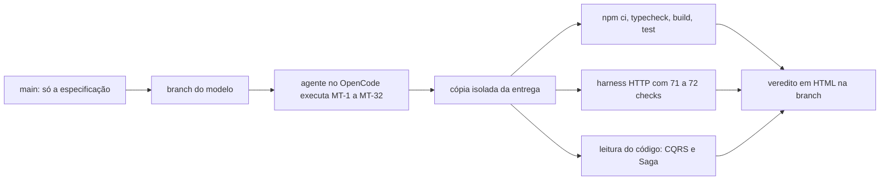

# Banco Demo v1: três modelos de IA implementando o mesmo backend

Aqui três modelos de IA implementam, sem ajuda humana, o mesmo backend bancário a partir da mesma especificação. Todos partiram do mesmo snapshot, receberam o mesmo backlog de 32 tarefas e rodaram no mesmo harness (OpenCode, reasoning alto, permissões automáticas). Depois avaliei cada entrega com a rubrica de [`docs/avaliacao-modelos.md`](docs/avaliacao-modelos.md), rodando a API de verdade: matando o processo no meio de transferências, disparando requisições concorrentes e conferindo os saldos direto no SQLite.

O relatório visual está em [`REPORT.html`](REPORT.html). Como o GitHub mostra só o código-fonte de arquivos HTML, baixe o arquivo ou clone o repositório e abra no navegador.

## Resultado

| Posição | Modelo | Nota do backend | Veredito | Tempo | Custo | Testes unitários |
|:-:|---|:-:|---|--:|--:|--:|
| 1 | GLM 5.3 | 97,5 | Aprovado | 1h19 | US$ 17,05 ¹ | 203 |
| 2 | Muse Spark 1.3 | 95 | Aprovado | 1h36 | US$ 53,62 | 132 |
| 3 | DeepSeek V4.1 Flash | 87,5 | Aprovado, com ressalva ² | 9 min 53 s | US$ 0,34 | 90 |

¹ Estimativa do LiteLLM pela tabela de preços dele. As chamadas foram para o plano de assinatura de código da z.ai, então a cobrança real pode ser outra.
² O logout do DeepSeek responde 204, mas a sessão continua válida no servidor. Contei isso como parcial em BE02, já que nenhum usuário consegue ver dados de outro. Se para você a revogação faz parte do critério eliminatório de autenticação, leia o resultado como reprovado nos requisitos obrigatórios; a nota bruta continua 87,5.

Os três passaram nos seis critérios eliminatórios e ficaram acima do corte de 80 pontos. Em nenhum cenário, de nenhum modelo, apareceu ou sumiu dinheiro: a soma dos saldos com o valor em trânsito ficou sempre em 125.000 centavos.

## Resumo

O GLM teve a maior nota. Os 2,5 pontos que perdeu vêm de um único defeito: JSON malformado no corpo de qualquer POST responde 500 em vez de 400. Foi também o único que fez commits, 22 ao todo, numa branch própria.

O Muse ficou 2,5 pontos atrás, por causa do signout. Com `Content-Type: application/json` e corpo vazio, a rota responde 500 e a sessão continua válida. Foi a execução mais cara e mais longa das três, e o contexto chegou a 306 mil tokens sem compactação.

O DeepSeek terminou em 10 minutos e gastou 34 centavos de dólar; os outros dois levaram mais de uma hora. Em troca, perdeu mais pontos. O logout não revoga a sessão, a Saga levou 29 segundos para retomar depois de um crash (o limite é 10) e a transferência para a própria conta devolve o código de erro errado. As correções são curtas e estão descritas no veredito dele.

Nesta rodada, a entrega mais confiável foi a do GLM. Se a ideia for iterar rápido e revisar o código depois, o DeepSeek custa uma fração dos outros, desde que o defeito do logout seja corrigido antes de qualquer uso.

## O que os modelos receberam

A especificação fica na `main`, e cada teste começa dela:

| Documento | Conteúdo |
|---|---|
| [`docs/prd-backend.md`](docs/prd-backend.md) | PRD v1.1: requisitos B01 a B10, CQRS, Saga, persistência, segurança, performance e definição de pronto |
| [`docs/contrato-compartilhado.md`](docs/contrato-compartilhado.md) | Endpoints, DTOs, autenticação por cookie, seed, catálogo de erros, idempotência e controles de teste |
| [`docs/avaliacao-modelos.md`](docs/avaliacao-modelos.md) | Rubrica de avaliação, com pesos, critérios eliminatórios e formato do relatório |

O sistema pedido é um banco local de demonstração, com signup, signin, signout, saldo, contatos e transferências entre contas. A especificação fixa a stack (Node.js, TypeScript, Fastify e SQLite em arquivo) e a arquitetura. Comandos e consultas seguem caminhos separados (CQRS), e cada transferência roda numa Saga orquestrada, persistida e capaz de retomar depois de um crash. Por decisão do dono do projeto, a entrega tem só testes unitários (PRD §8).

Antes do primeiro teste, a especificação virou um backlog de 32 tarefas (MT-1 a MT-32) e um guia de implementação no MCP my-backlog. Cada modelo recebeu a mesma instrução, "implemente por completo o backlog muse-test-muse", e fechou as 32 tarefas. Ao fim de cada execução, o backlog foi exportado para a branch do modelo e restaurado ao estado inicial para o teste seguinte.

## Como cada modelo rodou

| | Muse Spark 1.3 | GLM 5.3 | DeepSeek V4.1 Flash |
|---|---|---|---|
| Provider | OpenRouter (via LiteLLM) | API da z.ai, plano de código (via LiteLLM) | OpenRouter (via LiteLLM) |
| Harness | OpenCode | OpenCode 1.18.34 | OpenCode 1.18.34 |
| Reasoning | high | high | high |
| Permissões | automáticas | automáticas | automáticas |
| Intervenção humana | sem registro | nenhuma | nenhuma |
| Janela de uso | 01/10, 22:21 a 23:57 | 02/10, 00:37 a 01:56 | 02/10, 02:54 a 03:03 |
| Commits do agente | nenhum (sem repositório git) | 22 | nenhum |
| Fonte dos dados de uso | CSV de atividade do OpenRouter | log do LiteLLM e banco do OpenCode | log do LiteLLM e banco do OpenCode |

Horários em GMT+2. Os três escolheram a mesma base: `fastify`, `@fastify/cookie`, `better-sqlite3` e `vitest`, com Node 24.

## Como a avaliação funciona



A rubrica tem 12 itens com pesos que somam 100. Cada item recebe fator 1 (passa), 0,5 (parcial, com os subcasos enumerados) ou 0 (falha). Seis critérios são eliminatórios: Fastify e TypeScript funcionando, SQLite persistindo depois de reinício, CQRS identificável, Saga com commits separados e recuperação, autenticação com isolamento por usuário e nenhuma criação ou destruição de dinheiro. Falhar um deles reprova a entrega, qualquer que seja a nota. Com todos demonstrados e nota de 80 ou mais, a entrega é aprovada neste benchmark.

Não alterei o código de nenhum modelo. Os cenários rodaram por scripts externos: `harness.mjs` sobe o servidor compilado com um SQLite temporário, faz requisições HTTP reais, mata o processo com `kill -9` no meio de uma transferência e confere saldos e ledger direto no banco. Sondas separadas investigaram cada falha, e um teste externo do orquestrador cobriu o subcaso de compensação que a API não consegue combinar sozinha.

## Nota por item da rubrica

| Item | Peso | O que verifica | Muse | GLM | DeepSeek |
|---|:-:|---|:-:|:-:|:-:|
| BE01 | 5 | Instalação, build, migração, seed, reset e persistência | 5 | 5 | 5 |
| BE02 | 10 | Signup, signin e signout | 🟡 5 | 10 | 🟡 5 |
| BE03 | 10 | Autorização, isolamento, cookie e Origin | 10 | 10 | 10 |
| BE04 | 5 | Contatos | 5 | 5 | 5 |
| BE05 | 5 | Queries, DTOs e paginação | 5 | 5 | 5 |
| BE06 | 10 | Transferência normal | 10 | 10 | 10 |
| BE07 | 5 | Validação e saldo insuficiente | 5 | 🟡 2,5 | 🟡 2,5 |
| BE08 | 10 | Idempotência, inclusive concorrente e após restart | 10 | 10 | 10 |
| BE09 | 10 | Concorrência financeira | 10 | 10 | 10 |
| BE10 | 10 | Saga e compensação | 10 | 10 | 10 |
| BE11 | 10 | Crash com `kill -9` e recuperação | 10 | 10 | 🟡 5 |
| BE12 | 10 | CQRS, manutenção, testes e documentação | 10 | 10 | 10 |
| **Total** | **100** | | **95** | **97,5** | **87,5** |

🟡 marca item parcial. Nenhum item ficou com fator zero, e a cobertura foi de 100 pontos verificados nas três entregas.

## Requisitos do PRD

A rubrica transforma o PRD em cenários de teste. Esta tabela compara as entregas com os requisitos originais do PRD.

| Requisito do PRD | Muse | GLM | DeepSeek |
|---|---|---|---|
| B01 Signup persistido | ✅ | ✅ | ✅ |
| B02 Signin e signout, logout revoga a sessão | 🟡 falha só com JSON vazio no signout | ✅ | ❌ logout nunca revoga |
| B03 Saldo | ✅ | ✅ | ✅ |
| B04 Contatos | ✅ | ✅ | ✅ |
| B05 Transferir (202 PENDING, worker, Saga) | ✅ | ✅ | ✅ |
| B06 Acompanhar e paginar | ✅ | ✅ | ✅ |
| B07 Idempotência | ✅ | ✅ | ✅ |
| B08 Concorrência | ✅ | ✅ | ✅ |
| B09 Compensação | ✅ | ✅ | ✅ |
| B10 Recuperação sem duplicar efeitos | ✅ | ✅ | 🟡 correta, porém lenta |
| §7 Erros mapeados sem vazar detalhes | 🟡 alguns 4xx do Fastify viram 500 | 🟡 JSON malformado vira 500 | 🟡 código `SELF_RECIPIENT` no lugar de `SELF_TRANSFER`; 400 sem `details` |
| §8 Transferência terminal em até 5 s | ✅ 54 ms | ✅ 6 ms | ✅ 156 ms |
| §8 Recuperação em até 10 s | ✅ 378 ms | ✅ 366 ms | ❌ 29,0 s |
| §8 Só testes unitários, com cenários obrigatórios | ✅ 132 testes em 29 arquivos | ✅ 203 testes em 29 arquivos | 🟡 90 testes em 11 arquivos, sem teste do worker |
| §9 README, OpenAPI e relatório coerentes com a execução | 🟡 relatório com contagem e fuso errados | 🟡 OpenAPI sem o 403 de Origin; arquivo de rascunho commitado | 🟡 README diz que o logout revoga; relatório com contagem de testes antiga |

## Eficiência

A rubrica pede que tempo, custo e tokens fiquem fora da nota, então eles aparecem à parte.

| Métrica | Muse Spark 1.3 | GLM 5.3 | DeepSeek V4.1 Flash |
|---|--:|--:|--:|
| Duração da sessão | 95,7 min | 79,3 min | 9,8 min |
| Chamadas ao modelo | 556 | 341 (11 recusadas por limite do plano, depois da entrega) | 197 |
| Tokens de entrada | 107,9 mi | 59,8 mi | 27,6 mi |
| Tokens de saída | 159 mil | 184 mil | 120 mil |
| Reasoning, parte da saída | menos de 3% | 27% | 30% |
| Cache de prompt | 68,6% | 99,0% | 99,5% |
| Custo total | US$ 53,62 | US$ 17,05 ¹ | US$ 0,34 |
| Velocidade de geração | 121 tok/s | 77 tok/s | 280 tok/s |
| Velocidade ponta a ponta | 33 tok/s | 37 tok/s | 207 tok/s |
| Tempo até o primeiro token (mediana) | 4,5 s | 7,2 s | 0,72 s |
| Maior contexto | 306 mil tokens | 299 mil, compactado no fim | 237 mil |

O DeepSeek terminou cerca de 8 vezes mais rápido que o GLM e 10 vezes mais rápido que o Muse. O custo dele foi cerca de 50 vezes menor que a estimativa do GLM e 158 vezes menor que o do Muse. No Muse, o cache cobriu 68,6% do prompt; sem ele, a sessão custaria US$ 134,95.

As velocidades do Muse vêm do CSV do OpenRouter; as do GLM e do DeepSeek vêm dos horários de streaming gravados pelo OpenCode. As fontes medem quase o mesmo intervalo, mas não são idênticas.

## Defeitos encontrados

Abaixo estão os defeitos que custaram pontos, do mais grave ao mais leve. O veredito de cada modelo tem a lista completa, com arquivo, linha e passos para reproduzir.

### GLM 5.3

- JSON malformado em qualquer rota POST responde `500 INTERNAL_ERROR`; o contrato pede `400 VALIDATION_ERROR`. O parser que trata corpo vazio foi registrado no escopo raiz e repassa o `SyntaxError` sem `statusCode`.

### Muse Spark 1.3

- Signout com `Content-Type: application/json` e corpo vazio responde 500, não expira o cookie e mantém a sessão válida. O hook troca o corpo por `{}`, mas o `Content-Length` continua 0, e o Fastify recusa a requisição antes do handler.

### DeepSeek V4.1 Flash

- A rota de signout não registra o hook de autenticação, então o comando de revogação nunca roda e o token continua aceito por 24 horas.
- Depois de um `kill -9`, o job fica preso pelo lock da execução morta até o lease de 30 segundos vencer; a retomada levou 29 s.
- Transferência para a própria conta responde `SELF_RECIPIENT`. A função com o código certo existe em `errors.ts` e nunca é chamada.

Um achado de severidade baixa se repete nos três: a validação do corpo roda antes da autenticação, então uma requisição sem sessão e com corpo inválido recebe 400 em vez de 401. Muse e GLM também usam um único hash de senha para as três contas demo do seed, e o `/health` deles responde com um código fora do catálogo do contrato.

## Limites desta comparação

Cada modelo rodou uma vez. A rubrica pede pelo menos três gerações independentes antes de tirar conclusões sobre um modelo, então estes números descrevem três entregas, e uma nova rodada pode mudar a ordem.

O que se compara aqui é modelo e ferramenta juntos. Todos usaram o OpenCode, mas por caminhos diferentes: Muse e DeepSeek pelo OpenRouter, GLM pelo plano de assinatura da z.ai. O custo do Muse é a cobrança do OpenRouter; o do DeepSeek é o valor registrado pelo LiteLLM; o do GLM é uma estimativa.

A avaliação cobre só o backend, no escopo local definido pelo PRD, e não diz se alguma entrega está pronta para produção. Não houve frontend nem teste de integração com um.

## Estrutura do repositório

Cada modelo tem uma branch com a entrega completa e a avaliação:

| Branch | Conteúdo |
|---|---|
| [`main`](https://github.com/ferreirase/muse-spark-test/tree/main) | Especificação, este README e o [`REPORT.html`](REPORT.html) |
| [`glm`](https://github.com/ferreirase/muse-spark-test/tree/glm) | Código do GLM 5.3, `docs/veredito-backend-glm.html`, log do LiteLLM sem dados sensíveis, registro SDD e backlog executado |
| [`muse`](https://github.com/ferreirase/muse-spark-test/tree/muse) | Código do Muse Spark 1.3, `docs/veredito-backend-muse.html`, CSV de atividade do OpenRouter e backlog executado |
| [`deepseek`](https://github.com/ferreirase/muse-spark-test/tree/deepseek) | Código do DeepSeek V4.1 Flash, `docs/veredito-backend-deepseek.html`, log do LiteLLM sem dados sensíveis e backlog executado |

Em cada branch de modelo, `docs/backlog/` tem as 32 tarefas como o modelo as deixou, com resumo e notas, e o guia de implementação.

## Como inspecionar uma entrega

Clone o repositório e troque para a branch do modelo:

```bash
git clone git@github.com:ferreirase/muse-spark-test.git
```

```bash
cd muse-spark-test && git checkout glm
```

Abra `docs/veredito-backend-glm.html` no navegador para ler o veredito. Para rodar a entrega, use Node 24:

```bash
npm ci && npm run typecheck && npm run build && npm test
```

O README de cada branch, escrito pelo próprio modelo, explica as variáveis de ambiente, o seed com as contas demo e os controles de falha usados na avaliação.

## Como testar outro modelo

1. Crie uma branch a partir da `main`.
2. Rode o agente no OpenCode com reasoning alto e permissões automáticas, pedindo para implementar o backlog `muse-test-muse`.
3. Registre a janela de uso e exporte os dados de custo e tokens.
4. Avalie a entrega numa cópia isolada, seguindo `docs/avaliacao-modelos.md`, sem alterar o código do modelo.
5. Faça o commit da entrega, do veredito e do backlog exportado na branch do modelo, e restaure o backlog ao estado inicial.
