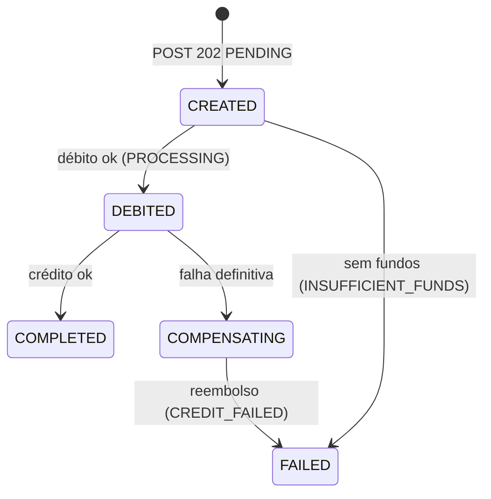

# Banco Demo — Backend

Backend bancário demo: Fastify + SQLite + CQRS + Saga orquestrada e persistida.
Contrato normativo: `docs/contrato-compartilhado.md`. PRD: `docs/prd-backend.md`.
OpenAPI: `openapi.json`. Controles de teste: `docs/test-controls.md`.

## 1. Requisitos

- Node.js 24 LTS (`engines >=24 <25`, `.nvmrc = 24`).
- `better-sqlite3` precisa de binário nativo: o prebuild para Node 24 funcionou nesta máquina sem toolchain extra. Se falhar, instale `python3`, `make`, `g++`.

## 2. Quickstart

```bash
npm ci
cp .env.example .env
npm run db:reset
npm run dev   # http://127.0.0.1:3001 (PORT/HOST/DATABASE_PATH via .env)
```

```bash
curl -s -c jar.txt -X POST http://127.0.0.1:3001/v1/auth/signin \
  -H 'Content-Type: application/json' \
  -d '{"email":"alice@demo.local","password":"Demo123!"}'
curl -s -b jar.txt http://127.0.0.1:3001/v1/accounts/me/balance
# {"accountId":"acc-alice","currency":"BRL","balanceCents":100000,...}
```

## 3. Credenciais demo

Senha de todas: `Demo123!`

| Usuário | E-mail | user.id | account.id | Saldo |
|---|---|---|---|---:|
| Alice Demo | alice@demo.local | user-alice | acc-alice | 100000 |
| Bruno Demo | bruno@demo.local | user-bruno | acc-bruno | 25000 |
| Carla Demo | carla@demo.local | user-carla | acc-carla | 0 |

Alice tem o contato `contact-bruno` (apelido `Bruno` → `acc-bruno`).

## 4. Scripts

| Script | O que faz |
|---|---|
| `npm run dev` | `tsx watch src/server.ts` |
| `npm run build` | `tsc` + copia migrações para `dist` |
| `npm start` | `node dist/server.js` |
| `npm run typecheck` | `tsc --noEmit` |
| `npm test` | `vitest run` (só unitários) |
| `npm run db:migrate` | aplica migrações pendentes |
| `npm run db:seed` | migra + insere seed sem alterar o existente |
| `npm run db:reset` | apaga tudo e restaura a fotografia inicial |
| `npm run openapi` | regenera `openapi.json` dos schemas |

## 5. CQRS

Rota POST → `commands/*` (escrita). Rota GET → `queries/*` (só SELECT, retorna DTO).

| Rota | Arquivo de rota | Handler | Acesso ao banco |
|---|---|---|---|
| POST /v1/auth/signup | `src/modules/auth/routes.ts` | `src/modules/auth/commands/auth-commands.ts` → `signup` | INSERT users/accounts/sessions (1 tx) |
| POST /v1/auth/signin | idem | idem → `signin` | SELECT user+account, INSERT session |
| POST /v1/auth/signout | idem | idem → `signout` | UPDATE sessions (revoga) |
| GET /v1/me | `src/modules/auth/me-routes.ts` | `src/modules/auth/queries/get-me.ts` | SELECT |
| GET /v1/accounts/me/balance | `src/modules/accounts/routes.ts` | `src/modules/accounts/queries/get-balance.ts` | SELECT |
| GET /v1/recipients/:accountId | `src/modules/contacts/routes.ts` | `src/modules/contacts/queries/get-recipient.ts` | SELECT |
| GET /v1/contacts | idem | `src/modules/contacts/queries/list-contacts.ts` | SELECT |
| POST /v1/contacts | idem | `src/modules/contacts/commands/add-contact.ts` | INSERT contacts |
| POST /v1/transfers | `src/modules/transfers/routes.ts` | `src/modules/transfers/commands/request-transfer.ts` | INSERT transfers+jobs (1 tx) |
| GET /v1/transfers/:id | idem | `src/modules/transfers/queries/get-transfer.ts` | SELECT |
| GET /v1/transfers | idem | `src/modules/transfers/queries/list-transfers.ts` | SELECT |

Sessões/cookies: `src/modules/auth/session-repository.ts`, `src/modules/auth/cookie.ts`, `src/http/plugins/auth.ts` (`requireAuth`).

## 6. Saga de transferência

Cada passo é uma transação `immediate` separada, com guarda `AND saga_step = <esperado>` (redelivery = no-op).

| saga_step | status público | effects (1 commit) |
|---|---|---|
| CREATED | PENDING | transfer + job PENDING (no POST) |
| DEBITED | PROCESSING | débito condicionado (`balance >= amount`) + ledger DEBIT + `in_transit = amount` |
| COMPLETED | COMPLETED | crédito + ledger CREDIT + `in_transit = 0` + job DONE |
| COMPENSATING | PROCESSING | falha definitiva registrada |
| FAILED (INSUFFICIENT_FUNDS) | FAILED | sem débito; job DONE |
| FAILED (CREDIT_FAILED) | FAILED | reembolso por soma + ledger COMPENSATION + `in_transit = 0` + job DONE |



- **Ponto de não retorno:** após o commit do crédito, nunca há compensação.
- **Compensar = somar de volta** (`balance + amount`), nunca restaurar snapshot.
- **Idempotência por passo:** ≤1 DEBIT/CREDIT/COMPENSATION por transferência (UNIQUE + triggers); CREDIT × COMPENSATION mutuamente exclusivos.
- **Invariantes:** `Σ saldos + Σ in_transit = 125000`; terminal ⇒ `in_transit = 0`; saldo nunca negativo.

## 7. Persistência

- Arquivo configurável por `DATABASE_PATH` (nunca `:memory:` no app).
- Pragmas por conexão: `journal_mode=WAL`, `foreign_keys=ON`, `busy_timeout=5000`, `synchronous=NORMAL`.
- Migrações versionadas em `src/db/migrations/` (`schema_migrations`); `001_init.sql` com tabelas `STRICT`, CHECKs de dinheiro/enums, triggers de sequência do ledger e imutabilidade (`BEFORE UPDATE/DELETE → ABORT`).
- Seed (`src/db/seed.ts`): `ON CONFLICT DO NOTHING`, nunca altera saldo. Reset: DROP + migrate + seed.

## 8. Reconciliação

```sql
-- saldo(conta) = saldo_seed(conta) + Σ ledger(conta)
SELECT a.id,
       a.balance_cents - COALESCE(SUM(l.amount_cents), 0) AS saldo_seed_implicito
FROM accounts a LEFT JOIN ledger_entries l ON l.account_id = a.id
GROUP BY a.id;
-- Σ saldos + Σ in_transit = 125000
SELECT (SELECT COALESCE(SUM(balance_cents),0) FROM accounts)
     + (SELECT COALESCE(SUM(in_transit_cents),0) FROM transfers) AS total;
```

Sinais do ledger: DEBIT negativo (remetente), CREDIT positivo (destinatário), COMPENSATION positivo (remetente). O seed não cria lançamentos de abertura.

## 9. Worker e retries

- Mesmo processo da API: polling (`WORKER_POLL_INTERVAL_MS`, default 200ms) + `wake()` no POST.
- Claim condicional com lease de 60s + `Set` in-flight (concorrência 4); boot libera locks (`releaseAllLocks` — **um worker por arquivo**).
- `RETRY_LATER` reagenda com `200ms·2^attempts` (teto 5s); transferência fica PENDING/PROCESSING, nunca FAILED sem compensar.
- Retry por passo: `SQLITE_BUSY`/`SQLITE_LOCKED`, 5 tentativas, `25ms·2ⁿ + jitter` (teto 1s).
- Metas: terminal em ≤5s após o POST; recuperação pós-reinício/release em ≤10s.

## 10. Controles de teste

Ver `docs/test-controls.md`. Ligar com:

```bash
ENABLE_TEST_CONTROLS=true TEST_CONTROL_TOKEN=<16+ chars> npm run dev
```

Rotas: `POST /__test/reset`, `POST /__test/faults`, `POST /__test/release` (header `X-Test-Control-Token`).

## 11. Testes

```bash
npm test   # vitest run — 132 testes unitários
```

**Escopo (decisão do dono do projeto, PRD v1.1 §8–§9): somente testes unitários.**
Cada teste chama a função/handler diretamente; unidades SQL usam SQLite temporário em arquivo (nunca `:memory:`); recuperação é testada reabrindo a conexão no mesmo arquivo. Cobertos: config, hash/token, erros, migrações, schema, seed, sessões, auth commands, queries (me/balance/recipient/contacts/transfers/cursor), passos da Saga, orquestrador, retry, worker, reset, faults, openapi.

**Declarado:** testes de integração HTTP (`fastify.inject`/servidor), e2e, spawn de processo/browser e recuperação com kill real de processo **não foram implementados** por decisão de escopo. Os fluxos HTTP foram verificados manualmente com `curl` durante o desenvolvimento (ver `docs/RELATORIO.md`).

## 12. Segurança

- Senha: scrypt (N=2¹⁴, r=8, p=1, salt 16B, `timingSafeEqual`); token de sessão 256 bits, banco guarda só SHA-256.
- Cookie `bank_session`: HttpOnly, SameSite=Lax, Path=/, Max-Age 86400, Secure conforme `COOKIE_SECURE`.
- Origin validada em mutações (sem Origin = CLI, passa); sem CORS; `Cache-Control: no-store` em `/v1/*` e `/__test/*`; logs com redaction (cookie, senha, token).

## 13. Limitações

- Um worker por arquivo SQLite (locks liberados no boot).
- `Idempotency-Key` sem expiração; escopo por conta remetente.
- Sessão 24h fixas, sem rotação/sliding.
- Sem edição/exclusão de contatos; destinatário vê o crédito mas não o histórico do remetente.
- `GET /health` retorna 503 `SERVICE_UNAVAILABLE` se o SQLite falhar (código fora do catálogo do contrato).
